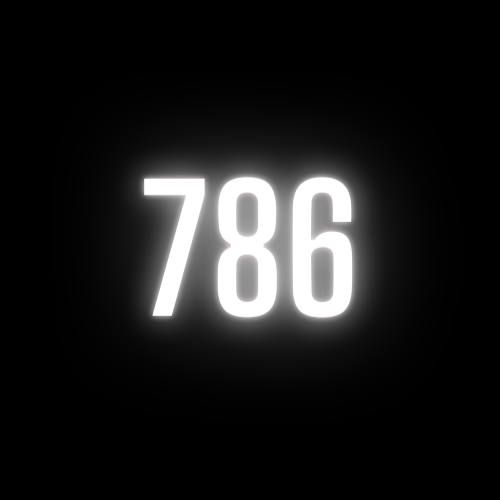

  

<h1 align="center" style="border-bottom: none;"><a href="https://786.world/">786</a></h1>

A community for muslims. Join us on <a href="https://discord.gg/DgtG3E24EY">Discord</a>.

## Overview

[786](https://vargiskhan.com/log/the-number-786-its-origin-meaning-and-significance/) is the numerical expression for “Bismillah al-Rahman al-Rahim” meaning "In the name of God, the Most Gracious, the Most Merciful". [786 World](https://786.world/) is a Discord based muslim community which provides a place for people to 
meet other like minded people and discuss their faith or exist in a place with the knowledge that everyone shares the same beliefs and values.

## Rationale

I grew up in Edinburgh, Scotland. The only muslim people I knew were my family and close relatives. When I left that all behind and moved to London, England, I felt a disconnect between who I was and the people around me. I didn't feel free to express my faith or beliefs. Many years on I've still struggled to find that community. My hope is this place can help us all connect regardless of where we reside.

## Guidelines

We don't condone negativity or hate. We promote equality and respecting differences. To anyone looking to invoke fear, hatred or abuse, there is a zero tolerance policy. Please do not bring islamaphobia to the group, please do not join to mock others who you don't know. Do not assume we will allow you to shame us into silence.

## Verification

Joining the community requires a Discord account which has a verified email. This is to police against bad actors in the system. We've had a number of issues with 
trolling and related issues. Verified accounts should ensure we can keep spam to a minimum.

## Join Us

Go to [Discord](https://discord.gg/DgtG3E24EY) to join us now.
